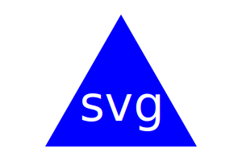

# 10-OOP-Challenge SVG Logo Generator 

## Overview

* Using the command-line to generate and provide a logo.svg file

* Using `npm` with packages `fs`, `inquirer`, and `jest`

* Contains `.gitignore` file for node_modules

* Using `jest` to test `render()` methods

## Installation

- Clone repository to your local machine
- Open new terminal window for the `index.js` file
- Type `npm i` then hit enter to install required packages
- Type `node index.js` then hit enter to start the application
- Answer the prompted questions, see examples folder for logo.SVG 
- Once complete, type `jest` in the terminal window to run test

## Video Tutorial 

[YouTube URL](https://www.youtube.com/watch?v=u9goPfKE33U)

## Logo Previews

